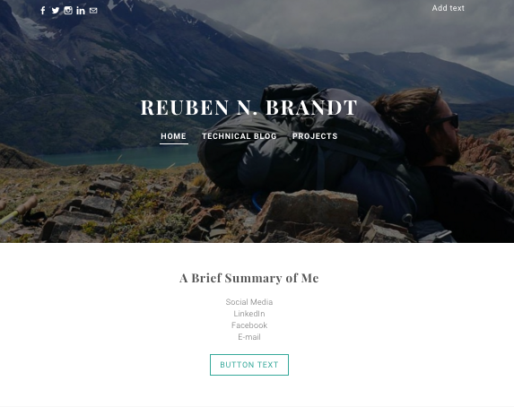

-What is a wireframe?

A wireframe is a conceptual idea of what you would like your website to look like.  It doesn't need to be polished, but everything you want on your site, should have a clear place within your wireframe.

-What are the benefits of wireframing?

Like anything else, it's always better to plan what you're going to do before you do it.  By wireframing you can make sure everything has its place, that you know what pictures you want, and you have the skills and code you need to make the website look the way you want it to. In effect it keeps everything nice and clean.

-Did you enjoy wireframing your site?

I don't really have much of a mind for design so drawing was very difficult for me.  I ended up using a website builder to help me get the design that I was most intersted in.  Of course, I won't use that to actually construct my site, simply use it as inspiration.

-Did you revise your wireframe or stick with your first idea?

I stuck with my first idea.  I certainly iterated within that process, but for the most part it was all a variation on one idea.

-What questions did you ask during this challenge? What resources did you find to help you answer them?

I really just needed someone who is more artistic than I am to help with the design, so I looked at other websites, and website design sites.

-Which parts of the challenge did you enjoy and which parts did you find tedious?

The initial frustration of trying to create a design from nothing was very challenging and tedious for me, but once I found a design I liked, I had a lot of fun making it look the way I want it!
