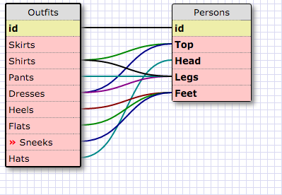

1) SELECT * FROM states;

2) SELECT * FROM regions;

3) SELECT state_name, population FROM states;

4) SELECT state_name, population FROM states ORDER BY population DESC;

5) SELECT state_name FROM states WHERE region_id IN (7);

6) SELECT state_name, population_density FROM states ORDER BY population_density ASC;

7) SELECT state_name FROM states WHERE population BETWEEN 1000000 AND 1500000;

8) SELECT state_name, region_id FROM states ORDER BY region_id ASC;

9) SELECT * FROM regions WHERE region_name LIKE '%Central%';

10) SELECT regions.region_name, states.state_name FROM states INNER JOIN regions ON states.region_id=regions.id ORDER BY regions.id;

Reflection

Databases allow data to be connected through the use of tables and various identifiers.

A one-to-many relationship is one where a unique id has many values (think state regions have more than one state).

A Primary Key is a unique identifier in a database table
A foreign key is points to a primary key in another table. If it's pointing to another table it's a foreign key, if it's pointing to a unique identifier,  on the same table then it's a primary key.

The easiest way is to simply press 'SELECT *' which will select all the data in the requested columns.  Or, you can SELECT BETWEEN, honestly there are many many different ways as it's sort of the main thing that SQL does!

